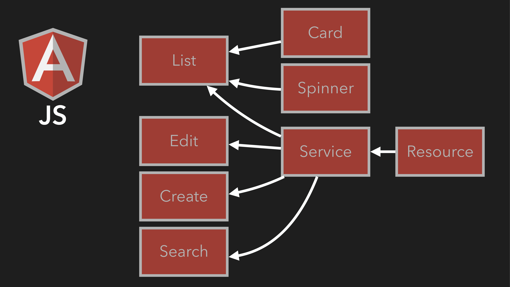
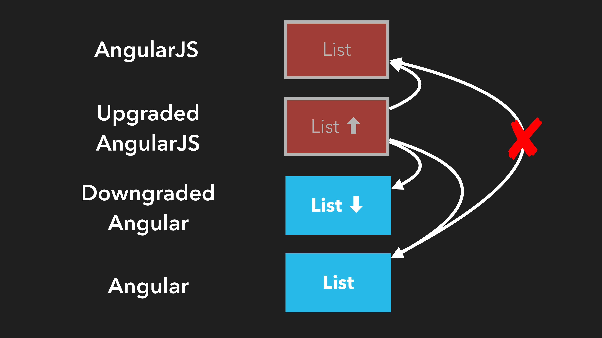

= Mental Model
:imagesdir: images/

In this lecture we are going to cover a way of thinking or reasoning about the AngularJS migration process. We call this a _Mental Model_ and it is essential that you understand this concept to successfully migrate your AngularJS application.

== Terminology and Practices
Before we get into it, lets have a look at some terminology and practices I will be following throughout this lecture series so that we are all on the same page.

=== Basic Terminology
AngularJS:: refers to the legacy Angular framework. Anything versioned 1.x is AngularJS.

Angular:: refers to the modern Angular framework. Anything versioned 2+ is Angular.

Now, lets take a look at some of the differences in terminology across AngularJS and modern Angular.
[width="100%",options="header"]
|====================
|What was it called in AngularJS?  |What is it called in Angular?
|Filters|  Pipes
|Controllers  |  Components
|Directives *+* HTML  |  Components
|Directives *-* HTML  |  Directives
|Services/Factories  |  Services
|====================

Entities::
An Entity is any single thing in an application. This could be a filter, a pipe, a controller, a component or a service.

=== Color Coding Schemes
We will be using the following color coding scheme to distinguish between the legacy and modern Angular entities.

* Angular is [blue]#BLUE#
* AngularJS is [red]#RED#

== Migration Concepts
[#img-component-diagram]
.Contacts application component diagram

Figure 1 is a simplified view of the AngularJS application that we are going to migrate, containing different entities such as Components, Controllers, Services and Resources.

=== Concept 1: Dual Booting
During the process of migration you will run both AngularJS and Angular in the same application, at the __same time__. We call this a hybrid application which allows entities written in both the legacy and modern Angular frameworks to co-exist and work together within the same application.

NOTE: The concept of Zones in Angular eliminates the need for $scope.$apply(...) in a hybrid application.

=== Concept 2: Interoperability
Although entities written in AngularJS and Angular work together in a hybrid application, they do not do this _directly_. Instead, we have to either *Upgrade* (applicable for AngularJS entities) or *Downgrade* (applicable for Angular entities) to ensure interoperability.

[#img-component-diagram]
.Interoperability of upgraded (AngularJS) and downgraded (Angular) components

* *An upgraded AngularJS entity* will work with other AngularJS entities as well as Angular and downgraded Angular entities.
* *A downgraded Angular entity* will work with other Angular entities as well as AngularJS and upgraded AngularJS entities.

TIP: Dependency injection still works! You can have the _same instance_ of a downgraded Angular service sharing data between an Angular and AngularJS component.

=== Concept 3: Who's in control?
Consider an AngularJS application with the following HTML hierarchy.

[#img-component-diagram]
.HTML hierarchy
image::./images/./images/3-img-003.jpg[]

Now, if we migrate the ``<card>`` entity to `Angular`, we will need to downgrade it to use it within the `AngularJS` ``<body>`` entity. Similarly, we will need to upgrade the `AngularJS` ``<spinner>`` entity to use it within the `Angular` ``<card>`` entity.

TIP: AngularJS is always bootstrapped first and owns the bottom most view. This makes the root component always AngularJS.

== The Plague
I like to think of the migration process as an infection or disease, gradually taking over an AngularJS application. The "disease" in this case is of course, Angular. Consider the application shown in Figure 4.

[#img-component-diagram]
.Application component diagram with downgraded Resource entity
image::./images/./images/3-img-004.jpg[]

1. We can first "infect" the Resource entity with Angular. To maintain compatibility, we will need to downgrade the Resource entity.

TIP: Start at the leaves and always favor downgrading Angular components over upgrading AngularJS components to maintain compatibility.

2. Next, we convert the Service entity to Angular while downgrading it to maintain compatibility with it's child entities.

[#img-component-diagram]
.Application component diagram with downgraded Service entity
image::./images/3-img-005.jpg[]

NOTE: The downgraded Resource entity can now be reverted back to Angular as it's dependent component(s) have been converted to Angular.

3. This process is then repeated throughout the application (from leaf upwards) until all components are migrated to Angular.

=== Caveats

* `Filters` in `AngularJS` cannot be migrated and will have to be re-written as `Pipes` during the migration process.
* Some directives (those without templates) will need to be re-written as `Angular` `Directives`.

== Summary
* The concept of *Dual Booting* allows entities written in both AngularJS and Angular to co-exist and work together within the same application.
* *Interoperability* of entities written in AngularJS and Angular is supported via upgrading or downgrading.
* Start at the leaves of the application and favor downgrading of entities over upgrading during the migration process.
* Some entities such as Filters and _some_ directives will need to be re-written as Angular entities during the migration process.
