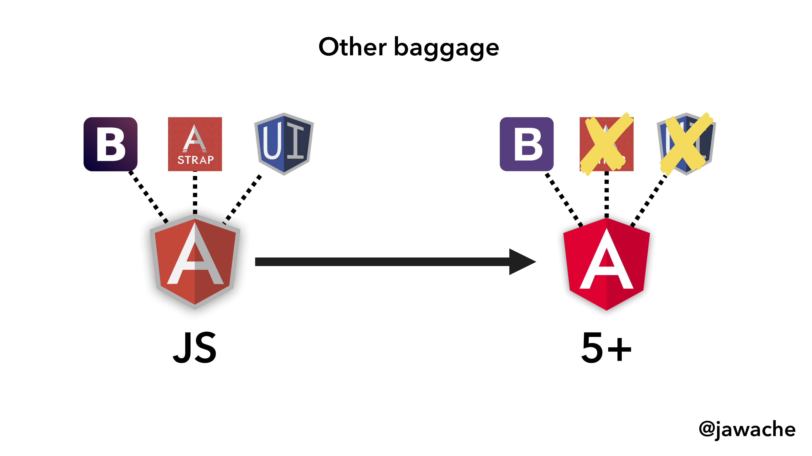
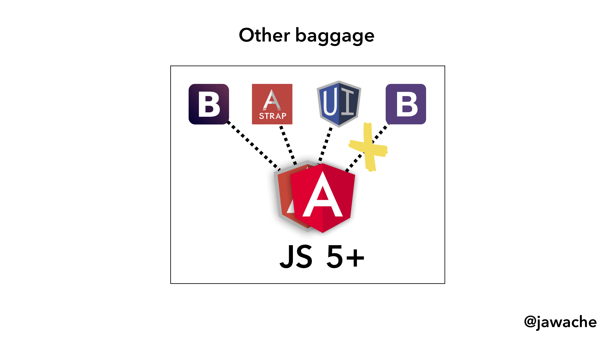

= Alternate IFRAME Migration - Method
:toc:
:toclevels: 5

== Lecture Objective
In this lecture, we will discuss an alternative migration strategy that you _could_ use to migrate your AngularJS application.

== Why do migrations fail?
Two of the biggest reasons for AngularJS application migrations to fail are,

1. Other baggage
2. Clean house

Lets see what each of these means in the context of an AngularJS migration.

=== Other baggage
AngularJS (and modern Angular) applications are typically built using multiple third-party dependencies. During our migration process, some of these third-party dependencies can be directly absorbed or switched out with an Angular equivalent without a problem.

[#img-component-diagram-1]
.Dependencies across AngularJS and Angular applications

However, in some cases these dependencies may clash with each other when we run our application in hybrid mode since they will be sharing the same global _namespace_. This is undesirable and can introduce many issues during our migration process. So what can we do about this?

[#img-component-diagram-2]
.A hybrid application running their own dependencies

Consider the example where we have an AngularJS application running bootstrap version 2.3.2.

To deal with this we can do either one of the following:

*1. Maintain the same Bootstrap version over to Angular*

[#img-component-diagram-3]
.Using the same Bootstrap version across a migration
image::./images/48-img-003.jpg[]

Although this approach may work, this is still backward thinking. If your main reason to migrate your application is to move away from legacy code, then this is definitely not the way forward.

*2. Upgrade Bootstrap version before migration*

[#img-component-diagram-4]
.Upgrade Bootstrap version before migration
image::./images/48-img-004.jpg[]

This approach definitely works but the downside is, there will be a lot of throwaway code from your AngularJS application that you have written to maintain compatibility with the Bootstrap version you upgraded to.

What we ideally want in a solution is the capability to directly migrate our dependent modules to their latest versions while we complete the migration to modern Angular.

[#img-component-diagram-5]
.Direct migration of dependencies to their Angular versions during migration
image::./images/48-img-005.jpg[]

Unfortunately, this is not something that can be easily done in the `ngUpgrade` approach.

=== Clean house

[#img-component-diagram-6]
.Clean house - the road to Angular
image::./images/48-img-006.jpg[]

Not all AngularJS applications follow best practices and are perfectly architectured. What this means is that, before we can start our migration process, we need to re-factor our code and fix any architectural issues that our application might have.

In fact, we saw this in our migration course as well; We dedicated most of the initial steps to re-write our application before starting our migration to Angular.

Unfortunately, this is easier said than done. If you are working on an AngularJS application the odds are that it has years and years of investment with lots of complexities that are not easy to re-factor out. It might even be the case that re-writing the application completely in Angular could be a better option than to re-architecture it to fit a migration.

So what can we do?

== Solution
My solution for all these problems, which I call the Iframe Migration Strategy is based on.. (you guessed it right!) _iframes_. The idea is to "iframe" in legacy AngularJS application to an Angular host as shown in the Figure below.

[#img-component-diagram-7]
.A hybrid application running their own dependencies
image::./images/48-img-007.jpg[]

To better understand this, lets take a look at a demonstration.

=== Demo
Consider the following application where we have a simple counter written in Angular.

[#img-component-diagram-8]
.Angular counter application
image::./images/48-img-008.png[]

Now, if we switch to AngularJS by clicking on the "AngularJS" button at the top, we switch to an AngularJS version of the same application _within_ an iframe.

[#img-component-diagram-9]
.Angular counter application
image::./images/48-img-009.png[]

If you analyze the `html` source of this AngularJS application, you will see that our AngularJS application code is in fact injected into an `iframe`.

[#img-component-diagram-10]
.Angular counter application
image::./images/48-img-010.png[]

This isn't one application, but two completely separate applications with one (the AngularJS application), being "iframed" into the other (the Angular application). This method allows our AngularJS application to remain exactly as it is, without any modifications whatsoever, inside an Angular host.

What we can do next is migrate our AngularJS application _one route at a time_, over to Angular. If the routes have been migrated over to Angular, the host application will handle it. If not, the component rendering will remain with the AngularJS application.

Now this is not a fully fledged solution, but an _idea_ that you can use as inspiration to modify and apply to your own AngularJS migration challenge. In the next lecture we will see how Route Ownership and Shared State is handled in this Iframe Migration Method.
