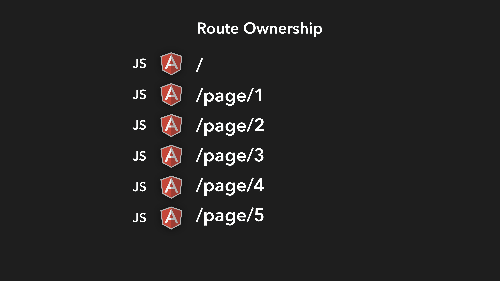
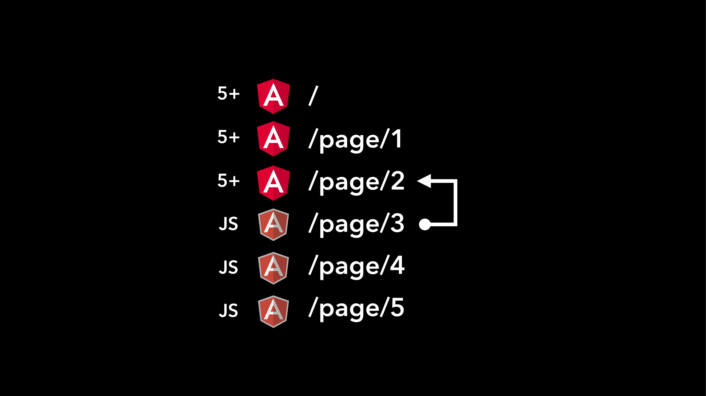

= Alternate IFRAME Migration - Code
:toc:
:toclevels: 5

== Lecture Objective
In this lecture we will dive into our iframe Migration Strategy, take a look at some code, see how *Route Ownership* is managed and finally look at the concept of *Shared State*. So lets get started!

== Route Ownership
Lets assume you just followed my iframe Migration Strategy and migrated your AngularJS application over to an Angular host. Your AngularJS application will now sit pretty inside an _iframe_, in an Angular context.

At this point, the route ownership of your application will remain entirely with your Angular application.

[#img-component-diagram-1]
.Route ownership at the start of the iframe Migration Strategy

Overtime, Angular starts taking over. We start migrating _one route at a time_, over from AngularJS to Angular. With each migration, the ownership of the corresponding route switches hands from AngularJS to Angular.

Eventually, we will have migrated everything over to Angular. At this point, there is nothing more to be done; Just drop your AngularJS application entirely because your migration is now complete.

[#img-component-diagram-2]
.Route ownership at the completion of the iframe Migration Strategy
image::./images/49-img-002.jpg[]

Lets rewind a bit. What exactly did I mean by, "Angular starts taking over"?

Consider the following route management code in both AngularJS and Angular.

.AngularJS route management
[source, javascript]
----
angular
    .module('legacy')
    .config(function ($stateProvider, $urlRouterProvider) {
      $stateProvider
          .state('angularjs', {
            url        : "/angularjs",
            templateUrl: './app/counter.html',
            controller : 'CounterCtrl'
          });
----

.Angular route management
[source, javascript]
----
const routes: Routes = [
  {path: '', redirectTo: 'angular', pathMatch: 'full'},
  {path: 'angular', component: CounterComponent},
  {component: IframeComponent, path: "**"}, // <1>
];
----

When we migrate an AngularJS route to Angular, this is where the configuration changes take place. With each route migration, a configuration will be removed from the AngularJS route configuration, and added into our Angular route configuration.

This is all good, but it also poses some interesting questions. Who owns the route? How is routing coordinated between AngularJS and Angular? To understand all of this, lets take a look at some use cases.

=== Use case 1: AngularJS - AngularJS route management

[#img-component-diagram-3]
.Routing between AngularJS routes
image::./images/49-img-003.jpg[]

This scenario is pretty straightforward. You are in an AngularJS context, trying to navigate into another `url` which is also in an AngularJS context.

There will be no communication between Angular and AngularJS and your AngularJS routing logic within the iframe will handle this scenario.

=== Use case 2: Angular - Angular route management

[#img-component-diagram-4]
.Routing between Angular routes
image::./images/49-img-004.jpg[]

Again, the scenario  has no complexities involved. You are in an Angular context, trying to navigate into a URL in an Angular context.

There will be no communication between Angular and AngularJS and your Angular routing logic will handle this scenario as expected.

=== Use case 3: Angular - AngularJS route management

[#img-component-diagram-5]
.Routing between Angular - AngularJS routes
image::./images/49-img-005.jpg[]

You are now in an Angular context, looking to navigate to an AngularJS context. This is when the complexities arise. How do we transfer route management from outside of our *iframe* (from an Angular context) to the AngularJS framework within it?

The answers lie in the "fallback route" syntax that is available in the Angular Router.

.app.routes.ts
[source, javascript]
----
const routes: Routes = [
  {path: '', redirectTo: 'angular', pathMatch: 'full'},
  {path: 'angular', component: CounterComponent},
  {component: IframeComponent, path: "**"}, // <1>
];
----

<1> A route configuration that acts as a fall-back route, which is matched if no other routes are found for the requested URL. This will then instantiate an `IframeComponent` and put it in the specified router outlet.

This fall-back route configuration allows us to switch context from Angular to AngularJS.

The `IframeComponent` itself has the following class-based implementation:

.app.routes.ts
[source, javascript]
----
export class IframeComponent implements OnInit {
  public url: SafeResourceUrl;
  private counter = 0;

  constructor(
    private route: ActivatedRoute,
    private sanitizer: DomSanitizer,
    private router: Router) {
      // <1>
    this.route.url.subscribe(urlSegments => {
      // Create a unique URL each time so the iframe will detect the change
      this.counter += 1;
      // <2>
      const requestedUrl = '/legacy/?counter=' + this.counter + '#!/' + urlSegments.join('');
      console.log(requestedUrl);
      // <3>
      this.url = this.sanitizer.bypassSecurityTrustResourceUrl(requestedUrl);
    });

    this.listenForFallbackRoutingEvents();
  }
  listenForFallbackRoutingEvents() {}
}
----

<1> We first subscribe to the `activated route`, which allows us to grab the requested URL

<2> The URL is then parsed into an AngularJS compatible format

<3> Here we bypass Angular's URL sanitation which allows us to obtain display the complete URL for the requested page, which will then be loaded inside the iframe.

=== Use case 4: AngularJS - Angular route management
[#img-component-diagram-6]
.Routing between Angular - AngularJS routes

This is the exact mirror scenario of use case 3. We request a URL while in an AngularJS context, that requires us to navigate into an Angular context. Again, the complexities lie in switching frameworks; This time we need to get _out_ from our iframe into Angular's route management.

The solution is similar to use case 3. Consider the AngularJS route configuration:

.app.routes.ts - AngularJS route configuration
[source, javascript]
----
.config(function ($stateProvider, $urlRouterProvider) {
  $stateProvider
      .state('cat', {
        url        : "/angularjs",
        templateUrl: './app/counter.html',
        controller : 'CounterCtrl'
      });
  // <1>
  $urlRouterProvider.otherwise(function ($injector, $location) {
    var path = $location.path();
    parent.postMessage({navigateTo: path}, "*"); // <2>
  });
});
----

<1> Similar to Angular, this code acts as a fall-back route when the requested URL is not matched. The callback function passed into the `otherwise` method will then be executed.

<2> This allows the iframe to communicate with its parent, which in this case is the Angular host.

Next, our Angular host needs to listen events originating from within the iframe. The following implementation does exactly that:

.iframe.component.ts
[source, javascript]
----
listenForFallbackRoutingEvents() {
  // Create IE + others compatible event handler
  const eventMethod = window.addEventListener ? "addEventListener" : "attachEvent";
  const eventer = window[eventMethod];
  const messageEvent = eventMethod == "attachEvent" ? "onmessage" : "message";

// <1>
  eventer(messageEvent, (e) => {
    if (e.data.navigateTo) {
      console.log('parent received message!:  ', e.data);
      let url = e.data.navigateTo;
      console.log(url);
      // <2>
      this.router.navigateByUrl(url);
    }
  }, false);
}
----

<1> The above code registers a listener which allows the Angular host to listen for message events emitted by the iframe.

<2> Upon receiving a message, the requested URL is then obtained and the Angular host will use the injected `Router` service to navigate to the requested application page.

== Shared State
An interesting observation in the demo application of our previous lecture is that the `state` was shared between the AngularJS and Angular applications, even though the applications itself had its own memory.

There are a few methods that can be used to achieve this behavior, but its important that your Angular and AngularJS applications _run on the same domain_. This provides the following advantages:

* Both applications can use the same cookies

* `LocalStorage` can be used to automatically share data between the applications.

NOTE: `LocalStorage` has size limitations. Therefore, depending on your data, it may be more efficient to obtain it from the API using two separate requests.

=== LocalStorage
Our demo application uses `LocalStorage` to persist its data. If you consider the AngularJS application, it has the following `counter.component.ts` component that manipulates the `counter` variable:

.counter.component.ts
[source, javascript]
----
(function () {
  angular
      .module('legacy')
      .controller('CounterCtrl', function ($scope) {
        $scope.counter = parseInt(localStorage.getItem("counter")) || 0;

        $scope.increment = function () {
          $scope.counter += 1; // <1>
          console.log("Setting the counter to " + $scope.counter);
          localStorage.setItem("counter", $scope.counter) // <2>
        };

        $scope.reset = function () {
          $scope.counter = 0;
          console.log("Setting the counter to " + $scope.counter);
          localStorage.setItem("counter", 0)
        }

      });
})();
----

<1> The `counter` is incremented.
<2> Here we persist our `counter` value to `LocalStorage`.

An advantage of using `LocalStorage` to store data is that when data is saved in `LocalStorage`, the browser fires a storage event. This event will be visible to all other windows open with the same origin, and can be listened to like so:

.counter.component.ts - local storage listener
[source, javascript]
----
window.addEventListener('storage', (e) => {
  if (e.key == "counter") {
    this.counter = parseInt(e.newValue);
    console.log("'counter' key updated to " + this.counter);
  }
});
----

This listener code is what is used in our demo application to share the counter variable between the AngularJS and Angular applications. Essentially, the code sits in both the Angular and AngularJS applications, "listens" for the `storage` event and updates its state s `counter` variable to the new value.

Well that is it then. This brings us to the end of my overview about the IFrame Migration Strategy. Again, this is not a complete solution, nor is it something that you should start your migration process with.

But if you are truly stuck, or if all other migration strategies does not seem to work for you, then give this a shot. This might just be what you are looking for.
