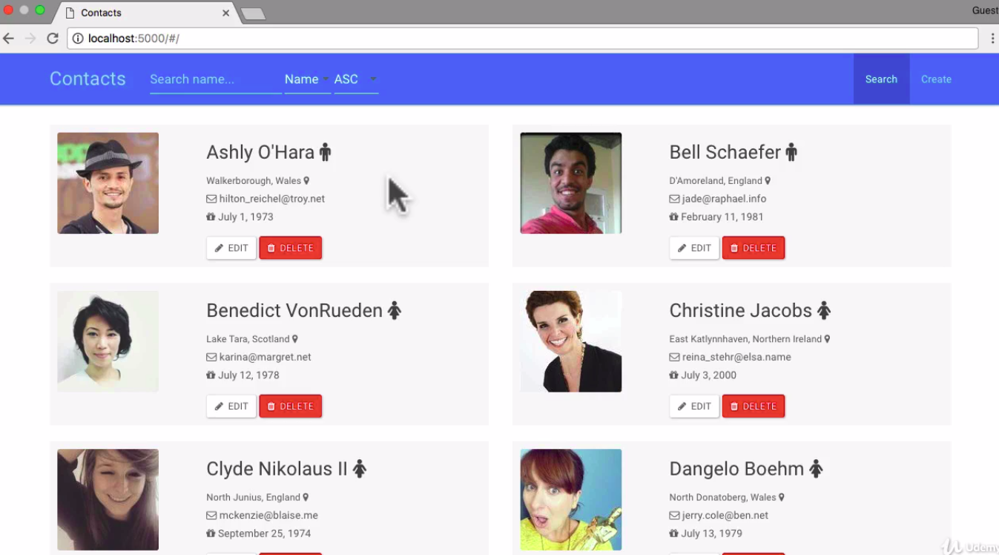

= The application we are migrating

In this lecture, we will briefly go through the application that we will be migrating from AngularJS to Angular.

== Overview

The application we will be migrating (reference Figure 1)  is a contact application that is very similar to the one we built in my original AngularJS course. At a very high level, this application allows a user to add and maintain a set of contacts in a database.

[#img-component-diagram]
.Contacts application home

The application will have the following functionalities

* Create/Edit/Delete a contact
* Search the contacts list
* Sort the contacts list
