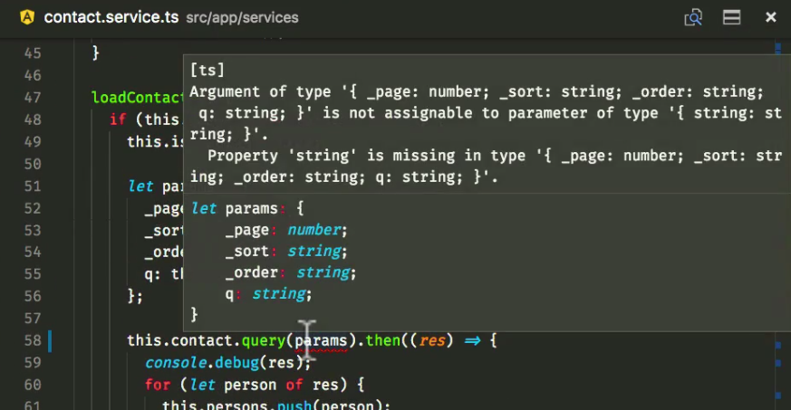
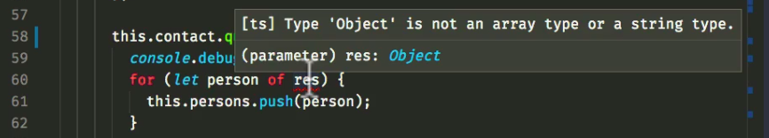

ifndef::ebook[]
include::{docdir}/content/courses/angularjs-migration/_includes/source-code.adoc[]
endif::ebook[]

= Migrate Contact Service
:toc:
:toclevels: 5

In this lecture, we are going to migrate our `contact.service.ts` entity to Angular and then downgrade it to maintain compatibility with our AngularJS entities across the application. So lets get started!

== Converting the Contact Resource to Angular

Our modernized `contact.service.ts` entity has a class-based implementation like so:

.contact.service.ts
[source, javascript]
----
import * as angular from 'angular';

export class ContactService {
  private Contact;
  private toaster;

  private page = 1;
  private hasMore = true;
  private isLoading = false;
  private isSaving = false;
  private isDeleting = false;
  private selectedPerson = null;
  private persons = [];
  private search = null;
  private sorting = 'name';
  private ordering = 'ASC';

  constructor(Contact, toaster) {
    this.Contact = Contact;
    this.toaster = toaster;
    this.loadContacts();
  }

  getPerson(email) {
    console.log(email);
    for (let person of this.persons) {
      if (person.email === email) {
        return person;
      }
    }
  }

  doSearch() {
    this.hasMore = true;
    this.page = 1;
    this.persons = [];
    this.loadContacts();
  }

  doOrder() {
    this.hasMore = true;
    this.page = 1;
    this.persons = [];
    this.loadContacts();
  }

  loadContacts() {
    if (this.hasMore && !this.isLoading) {
      this.isLoading = true;

      let params = {
        _page: this.page,
        _sort: this.sorting,
        _order: this.ordering,
        q: this.search
      };

      this.Contact.query(params).then((res) => {
        console.debug(res);
        for (let person of res.data) {
          this.persons.push(person);
        }

        if (!res.data) {
          this.hasMore = false;
        }
        this.isLoading = false;
      });
    }
  }

  updateContact(person) {
    return new Promise((resolve, reject) => {
      this.isSaving = true;
      this.Contact.update(person).then(() => {
        this.isSaving = false;
        this.toaster.pop("success", "Updated " + person.name);
        resolve();
      })
    })
  }

  removeContact(person) {
    return new Promise((resolve, reject) => {
      this.isDeleting = true;
      this.Contact.remove(person).then(() => {
        this.isDeleting = false;
        let index = this.persons.indexOf(person);
        this.persons.splice(index, 1);
        this.selectedPerson = null;
        this.toaster.pop('success', 'Deleted ' + person.name);
        resolve()
      });
    });
  }

  createContact(person) {
    return new Promise((resolve, reject) => {
      this.isSaving = true;
      this.Contact.save(person).then(() => {
        this.isSaving = false;
        this.selectedPerson = null;
        this.hasMore = true;
        this.page = 1;
        this.persons = [];
        this.loadContacts();
        this.toaster.pop('success', 'Created ' + person.name);
        resolve()
      });
    });
  }

  loadMore() {
    if (this.hasMore && !this.isLoading) {
      this.page += 1;
      this.loadContacts();
    }
  }
}

angular
  .module("codecraft")
  .service("ContactService", ContactService);
----

Lets look at how we can convert this class (and its services) to Angular.

=== Dependency injection
The `ContactService` class requires an instance of the `Contact` class to provide its functionality to the rest of the application. We can start our conversion by modifying the `ContactService` constructor to inject this required instance into our class like so:

[source, javascript]
----
...
import { Inject } from "@angular/core";

export class ContactService {
...
  constructor(@Inject(Contact) private contact: Contact) {
    this.loadContacts();
  }
...
}
----

NOTE: You may have noticed that I have dropped the `toaster` parameter from the constructor argument. This is because injecting `toaster` is slightly more complicated and will be covered in the next lecture. For now, we will remove all references in our code to the `toaster` module.

Modify the rest of the code to reflect these changes like so:

* Replace all occurrences of `this.Contact` with `this.contact` since our `Contact` instance is now referenced via the `contact` variable.

* Remove the declarations and the initializations of the `Contact` and `toaster` private variables.

* Comment out all occurrences of the following code line since we are dropping all `toaster` references for this lecture.
----
this.toaster.pop(...)
----

=== Typescript error checking
Lets deviate a bit from the objective of this lecture, and have a look at the importance of `Typescript` in our application.

If you are using a capable `IDE` that leverages some of Typescript's advanced type checking and error reporting functionality in your source files, you may have noticed the following type check error in the `contact.service.ts` file:

[#img-component-diagram]
.Typescript type check error 1

The reason for this lies in the type definition syntax of the `query` function (and the `get` function) in our `contact.resource.ts` file. This can be fixed by updating the argument type definition of the `query` and `get` functions from:

[source, javascript]
----
(params: { string: string })
----

to:

[source, javascript]
----
(params: { [key: string]: string })
----
This implies that both these functions expect as an argument an object with key-value pairs of type `string`. Because of this strict type safety, we will also need to change the `_page` property value in the `params` object (which is a number!) to a string like so:

[source, javascript]
----
let params = {
  ...
  _page: this.page.toString(),
  ...
}
----

However, we are still not out of the woods. If you look closely, you will notice a second type check error like so:

[#img-component-diagram]
.Typescript type check error 2

This is because the resolved promise from the `query` method is expected to return an `Array` but actually returns an `Object`. To fix this, cast the return object of the `query` method to an array like so:

[source, javascript]
----
query(params: { [key: string]: string }): Promise<Array<any>> {
  return this.http.get<Array<any>>(this.apiRoot, { params }).toPromise();
}
----

TIP: It is possible to further improve type safety by creating a `Person` model and casting the return object to an Array of type `Person` like so: `<Array<Person>>`

== Downgrading our Contact Service

Similar to our previous lecture, we can now downgrade our contact service so that it maintains compatibility with the AngularJS entities in our application.

Import the `downgradeInjectable` function into our `contact.service.ts` class like so:
[source, javascript]
----
import {downgradeInjectable} from '@angular/upgrade/static';
----

Next, modify the component registration code:

[source, javascript]
----
angular
  .module("codecraft")
  .factory("ContactService", downgradeInjectable(ContactService));
----

Finally, to make our `ContactService` service available to the  Angular Dependency Injection Framework, add it as a `provider` in the `NgModule`:

[source, javascript]
----
....
import { HttpClientModule } from '@angular/common/http';

@NgModule({
  imports: [
    BrowserModule,
    UpgradeModule,
    HttpClientModule
  ],
  providers: [
    Contact,
    ContactService
  ]
})
....
----

== Revert Resource downgrade

Lets look at a visualization of our application's state at this point:

[#img-component-diagram]
.Application component diagram with converted Service and Resource entities
image::./images/29-img-003.jpg[]

An interesting observation with the conversion of the `Service` entity to Angular is that our `Resource` entity is now no longer used by any AngularJS services. Therefore, we can revert back its downgrade, converting it in to a purely Angular entity.

This can be done by removing the AngularJS component registration code:

[source, javascript]
----
angular
  .module("codecraft")
  .factory("Contact", downgradeInjectable(Contact));
----

and their dependent imports:

[source, javascript]
----
import * as angular from 'angular';
----

from the `contact.resource.ts` file.

== Verification

Re-build the project and run it on `localhost` as before, and everything should function as expected. (except for the `toast` functionality which we will fix in the next lecture!)
